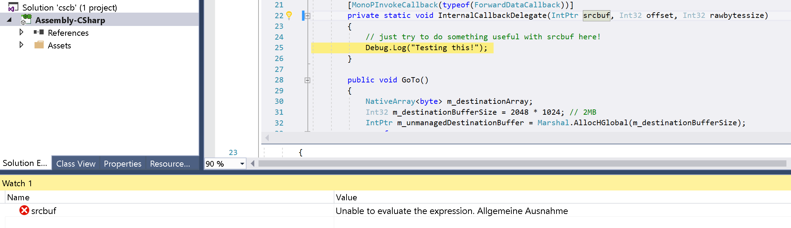

# Unity / C++ Failed Reading from NativeArray on Windows without SafetyHandle

This repo contains an example about the failure to access a native array (a `void*` memory pointer marshalled to an `IntPtr` into Unity) on Windows x64 without the use of a safety handle

- Windows 10 (21H1)
- tested with 2019.4.32f1
- used visual studio 2017 and 2019 (newest as of Nov. 11 2021)

## Instructions

1) build `cpp` directory first with cmake and VS17 or VS19. The output of the build will end up directly in the unity assets folder. make sure to build for x64!

2) fire up unity and try to run the sample scene. If you have debugging in VS, you will see that there is a failure to marshal the `srcbuf`.

3) run without the `USEHANDLE` flag set - will be unable to read from buffer

4) add `#define USEHANDLE` at the beginning of `TestLoopBack.cs` and run again - works like a charm!
